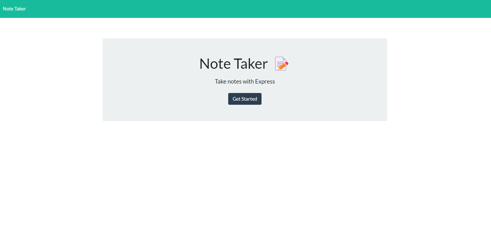
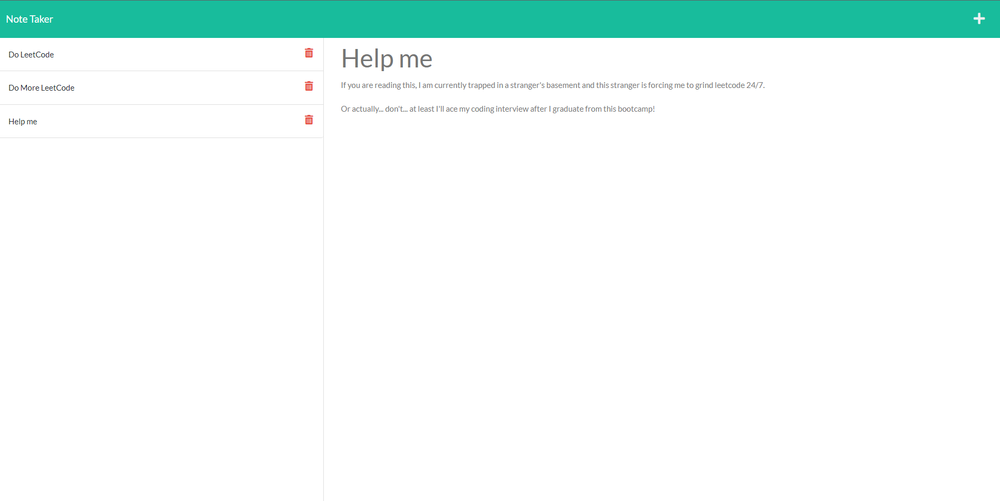

# Note Taker Application


## Description

The purpose in creating this application was for users to quickly write down their thoughts to organize their work schedule or even days. They can jot down any tasts they would have coming up or any thing they HAD to do for the week or even month.

If you dont have anything like Microsoft Word, this is your go to note taking application. (Who uses notepad...?)

If you would like to try out my application, please visit my applicatiom via the link below!

### Heroku Link [Click Here](https://dan-note-taker-appication.herokuapp.com/) to use the application!

## Table of Contents

1. [Installation](#installation)
2. [Usage](#usage)
3. [Questions](#questions)
4. [License](#license)

## Installation

There are no prior installations needed to use the application deployed on heroku.

However, if you would like to utilize the code and run it through the terminal, please follow the following steps.

You would first clone the repository down and run the following code block.

```
npm i
```

This will install all of the node modules needed to run this. Express, nodemon, etc.

Once you have downloaded, run the following code block.

```
npm run watch
```

This will start up the server under nodemon and will actively look for changes in your code if you decide to change anything.

Follow the link to http://localhost:3001 after you run the server and you should be able to utilize the applicaiton.

## Usage

Please see the screenshots below!

### Screenshot of Home Page



### Note Page



Once you are in the notes page, you can create a new note by pressing the + icon on the top right corner.

Once you type in some text, you will be able to press the save icon next to the + icon.

If you would like to delete the note, you can click on the red trash can to delete.

## Questions

If you have any questions, please feel free to reach out to me via:

1. Email: dhong0925@gmail.com
2. GitHub: Lunirs

## License

Licensed under the MIT license.

## Credits

Copyright © Daniel Hong All rights reserved.
